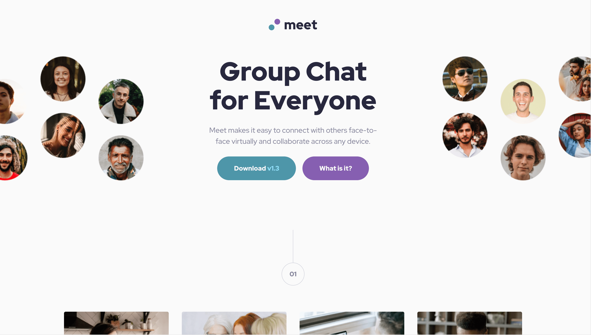

# Frontend Mentor - Meet landing page solution

This is a solution to the [Meet landing page challenge on Frontend Mentor](https://www.frontendmentor.io/challenges/meet-landing-page-rbTDS6OUR). Frontend Mentor challenges help me improve my coding skills by building realistic projects.

## Table of contents

- [Overview](#overview)
  - [The challenge](#the-challenge)
  - [Screenshot](#screenshot)
  - [Links](#links)
- [My process](#my-process)
  - [Built with](#built-with)
  - [What I learned](#what-i-learned)
  - [Continued development](#continued-development)
  - [Useful resources](#useful-resources)
- [Author](#author)
- [Acknowledgments](#acknowledgments)

## Overview

### The challenge

The brief for this challenge was to build out the landing page and get it looking as close to the design as possible, starting with the following assets:

- Figma design file access
- Mobile, tablet & desktop layouts
- Professional design system for colors, fonts, etc.
- Optimized image assets
- HTML file with pre-written content

Users should be able to:

- View the optimal layout depending on their device's screen size
- See hover states for interactive elements

### Screenshot

### Links

- _Link to Frontend Mentor solution comming soon_
- [Live site](https://sabineemden.github.io/fm-meet-landing-page/)

## My process

I completed this challenge as part of the Frontend Mentor learning path [Building responsive layouts](https://www.frontendmentor.io/learning-paths/building-responsive-layouts--z1qCXVqkD). It is the final of four challenges on this learning path and brings together responsive images, fluid typography, and flexible layouts.

### Built with

- Semantic HTML5 markup
- CSS custom properties
- Flexbox
- CSS Grid
- Mobile-first workflow

### What I learned

This project was bigger than most other challenges I have completed for Frontend Mentor so far. It was more demanding because it combined a couple of small to mid-sized issues on one page:

- Layout shifts between mobile, tablet, and desktop designs,
- A hero image that splits into two for the desktop design,
- Headings with fluid typography,
- Button and number components,
- An image gallery with square grid items,
- A background image with a color overlay.

### Continued development

I used a mobile-first workflow for this challenge. However, I didn't build the whole mobile view before I adapted the code for the tablet and desktop views. I went section by section. For each section, I built out the mobile view first, then added the tablet and desktop view.

This worked well because to plan my approach for each section I had to figure out how the design changed from mobile to tablet to desktop. By adding these changes immediately after I finished the mobile design for each section, I still had them fresh on my mind.

I might keep this approach for future projects or experiment with finishing the whole mobile design first while adding comments to the CSS style sheet to keep track of what needs to be changed later for the tablet and desktop views.

### Useful resources

- [Fluid Typography Tool](https://fluidtypography.com/) - I used this tool to generate the `clamp()` functions for fluid typography.
- [Lower the opacity of a background-image with CSS](https://www.youtube.com/watch?v=lRPguPbovro) by Kevin Powell on YouTube - This video helped me figure out how ad the the color overlay to the background image.

## Author

I'm an aspiring web developer and a former chemist. What I bring from chemistry to software development is a systematic approach to problem solving and the perseverance to not give up easily.

- Frontend Mentor - [@SabineEmden](https://www.frontendmentor.io/profile/SabineEmden)
- Personal Website - [Sabine Emden](https://www.sabineemden.com/)
- Mastodon - [@sabineemden](https://social.tchncs.de/@sabineemden)

## Acknowledgments

This solution uses a CSS reset based on [A Modern CSS Reset](https://www.joshwcomeau.com/css/custom-css-reset/) by Josh Comeau.

The font family in this project is [Red Hat Display](https://fonts.google.com/specimen/Red+Hat+Display). The fonts are licensed under the [Open Font License](https://openfontlicense.org/open-font-license-official-text/).
